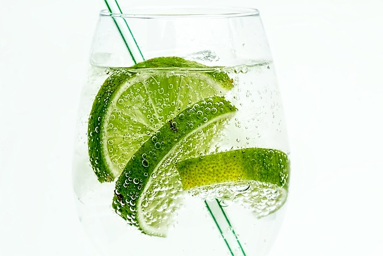

<br />
<div align="center">
     

<h2 align="center">CocktailParadise</h2>
<br/>

<p align="center">CocktailParadise is an application designed for searching cocktails.<br /> Search for the cocktail that's right for you or choose your ingredient. Drink with taste and responsibly</p>
<a href="https://cocktailsparadise.netlify.app/"><strong>View Demo</strong></a>
<br />
</div>
<br /><br />

<details>
  <summary>Table of Contents</summary>
  <ol>
    <li><a href="#built-with">Built With</a></li>
    <li><a href="#installation">Installation</a></li>
    <li><a href="#usage">Usage</a></li>
    <li><a href="#technical-choices">Technical Choices</a></li>
    <li><a href="#license">License</a></li>
    <li><a href="#contact">Contact</a></li>
  </ol>
</details>

## Built with

<ul style="list-style-type: none;">
<li>

</li>
<li>
  
</li>
<li>

<li>

</li>
<li>

</li>
</ul>

## Installation

1. Clone the repo
   ```sh
   git clone https://github.com/David92p/CocktailParadise.git
   ```
2. Install NPM packages
   ```sh
   npm install
   ```
3. Run
   ```sh
   npm run dev
   ```
4. Press "o" or click the link in the terminal.

## Usage

<ul style="list-style-type: none;">
    <li>
      <h4>Navigating the Home</h4>
      <div align="center">
        
      </div>
      <br />
      <ul>
        <li>Scroll through the cart with different random cocktails</li>
        <li>Search for your cocktails by category, glass and selected type, press the button to start your search and scroll through the results</li>
      </ul>
    </li>
    <br />
    <li>
      <h4>Navigating the Ingredients</h4>
      <div align="center">
        
      </div>
      <br />
      <ul>
        <li>Use the Next and Prev buttons to scroll through random ingredients.</li>
        <li>Look at the results for your ingredient and scroll to them if the search is large.</li>
        <li>Use the search if you need a specific ingredient. When possible a brief description of the ingredient will be at your disposal.</li>
      </ul>
    </li>
    <br />
    <li>
      <h4>Navigating the About</h4>
      <div align="center">
        
      </div>
      <br />
      <ul>
        <li>A brief description of the application is present at the top of the page</li>
        <li>Tools and resources used for development are present in the central body of the page.</li>
      </ul>
    </li>
    <br />
    <li>
      <h4>Navigating the Contact</h4>
      <div align="center">
        
      </div>
      <br />
      <ul>
        <li>Use the contact form for any information regarding the code.</li>
        <li>Contact me if you think about making improvements to the project or simply want information about it.</li>
      </ul>
    </li>
    <br />
  </ul>
  
  ## Technical Choices
  
  
  <ul
    <li><h3>React</h3></li>
    <ul>
        <li>It was chosen for its practicality in integrating with the numerous libraries available and exploiting dynamic and engaging interfaces thanks to its component-based structure and virtual DOM.</li>
     </ul>
  </ul>
  <ul
    <li><h3>Typescript</h3></li>
    <ul>
        <li>Type checking in a project helped me find any code errors earlier and be able to fix them in less time than pure JS.</li>
     </ul>
  </ul>
  <h4></h4>
    <ul
    <li><h3>TailwindCSS</h3></li>
    <ul>
        <li>Used to model the application smoothly and efficiently through the classes provided by the library.</li>
     </ul>
  </ul>
  <h4></h4>
    <ul
    <li><h3>React Router</h3></li>
    <ul>
        <li>The use of this library was necessary to allow the client to navigate smoothly and render different views in the application.</li>
     </ul>
  </ul>
  <br>
  
  ## License

Distributed under the MIT License.

## Contact

Linkedin - [</img>](https://it.linkedin.com/in/davide-panetta-065420207)

GitHub - [</img>](https://github.com/David92p)

Project Link - [</img>](https://github.com/David92p/CocktailParadise/tree/main)


